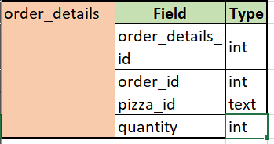
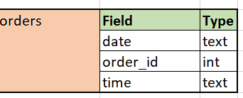
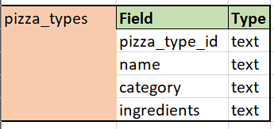

# 🍕Pizza-Sales_SQL_Data-Analysis
This project focuses on analyzing transactional sales data from a pizza store using SQL to extract meaningful business insights. By examining order volume, revenue trends, and product performance, the analysis aims to uncover patterns in customer behavior and sales dynamics. The project involves querying the database to identify top-selling pizzas, peak ordering times, and category-wise performance.
## 🎯Project Objective
The SQL Pizza Sales Analysis project aims to:

-Extract, join, group, and aggregate sales data to generate insights.

-Understand customer behaviour, identify sales trends, and evaluate operational patterns.

-Provide data-driven findings to support business decision-making.
## 🗂️Dataset Overview + ERD





## ⚙️Tech Stack & Skills
-SQL – Data extraction, joins, aggregations, subqueries, CTEs

-Data Cleaning – Handling missing values and inconsistencies
## 📑Key Analysis Performed
-Top-Selling Pizzas – Identified highest revenue and quantity contributors.

-Category-Wise Performance – Analyzed sales trends across pizza categories.

-Revenue Trends – Monthly, weekly, and daily order volume analysis.

-Peak Ordering Times – Identified high-demand hours and days.

-Customer Behavior Patterns – Insights into average order size, preferences, etc.
## 📊Insights
Detailed insights can be found in:
[Pizza_Sales_Analysis](Pizza_Sales_Analysis.pdf)
## 🚀How to Use
-Clone the repository:  
   ```bash
   git clone https://github.com/AnjaniRaman/SQL-Pizza-Sales_Data-Analysis.git
```

-Import dataset into your SQL environment.

-Run queries from the  folder.

-Refer to [Pizza_Sales_Analysis](Pizza_Sales_Analysis.pdf) for detailed insights.

The dataset contained some missing values,which may have limited certain customer behavior insights. However,the overall sales and trend analysis remained consistent.
